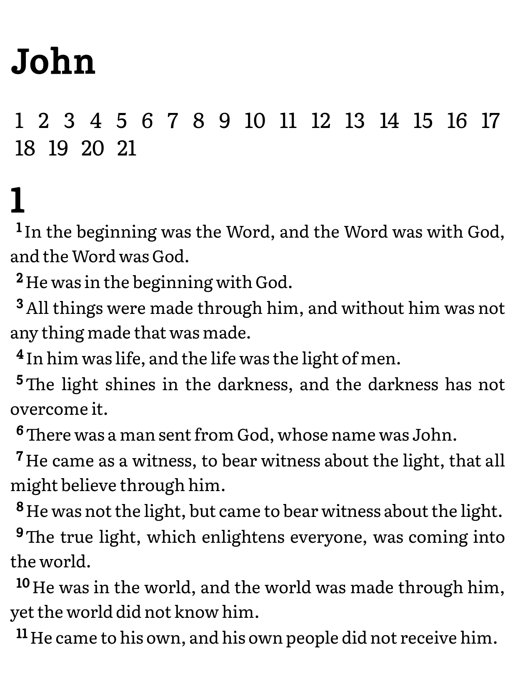
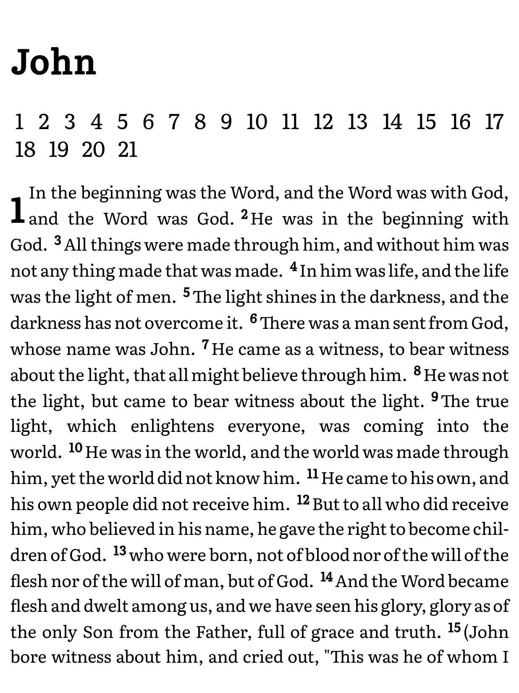

# beblia-ebook

This is just a fun little weekend project experiment. While researching other tools, I discovered the [Beblia project](https://github.com/Beblia/Holy-Bible-XML-Format) which has a very large collection of Bible translations in a specific XML format. Then I got thinking, XML isn't that different than HTML, and HTML is used for eBooks in the EPUB format. So I started brainstorming a way to generate an eBook from one of these XML files. A XML transform (XSLT) seemed like the most straightforward way to transform the raw data into a nice presentable format.

Here's a screenshot of the generated output, converted to EPUB and running in KOReader:


The goal is to have something that is easy to drop into Calibre, convert to an EPUB and use on an EReader. The generated files as compact as possible (~1.5MB), have minimal styling, and are fully hyperlinked for easy navigation. The table of contents links to the beginning of each book. At the beginning of each book there is a link to each chapter in that book. It is also fully backlinked. Each chapter number links back to the beginning of the book, and the book name links back to the table of contents, making it only 4 taps to go from any chapter to any chapter.

## Prerequisites

You'll need a couple of things to be able to utilize this code.

### An XML file from Beblia

Head over to the [Beblia project page](https://github.com/Beblia/Holy-Bible-XML-Format) and grab whichever XML file you like in your preferred language or translation.

### An XSLT processor

You will need a program to apply the the transform to the XML file. There are lots of options out there depending on what OS you're on. For example, one open source processor is `xsltproc`. On Ubuntu you can install it by running:

```
$ sudo apt-get install xsltproc
```

## Running the code

Simply invoke your XSLT processor and apply the transform to your XML file of choice.

```
$ xsltproc -o output.htm transform.xml <DOWNLOADED_XML_FILE.xml>
```

## Customization

There are several options for customization available.

### Changing paragraph style

Beblia does not contain information for paragraph breaks in any of the files that I have looked at. Thus, the default presentation is a line-by-line style with each verse starting a new line. While possibly less traditional, this style presentation is used in some printed Bibles, and has the distinct advantage of very quickly being able to find the beginning of a specific verse. This can be useful when preaching, teaching, reading aloud, or studying in a group.

If you do not prefer this style, you can uncomment the following `<link>` tag in the `<head>` section of `transform.xsl`:

```html
<!-- Uncomment this line to produce a paragraph style text body instead of the line by line style -->
<link rel="stylesheet" href="paragraph.css" />
```

This will apply another CSS stylesheet that will display each chapter as a paragraph of text along with a drop cap chapter number. While this is a more traditional style, the paragraph breaks normally found in printed Bibles will not be not be included, due to that information not being present in the Beblia XML file.



### Changing book names (for other languages)

Most Beblia XML files that I have seen do not include the names of the books of the Bible. I have included a default list of names of the books in English in this repo. However, if you are transforming a translation in a different language, and want the names of the books to also appear in that language you have two options.

#### Option 1:

Add `name` attributes to your downloaded XML file. As an example:

```xml
<book number="1" name="Génesis">
```

I added this because it is compatible with other software such as FreeShow. However, this can be time consuming to search through the XML document and add all these. But if you already have a document that you're using in FreeShow with customized book names, they should be supported here too.

> **Note**: If your XML document includes `name` attributes on teh book tags, these will be preferred over the default names found in `book-names.xml`

#### Option 2:

You can also modify `book-names.xml` to include the names of the books in whatever language you desire. If your XML document does not include `name` attributes in the book tags, these names will be used.
